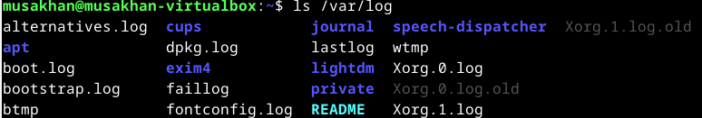

## Tivistelmä
**Komentorivin käyttö**: "pwd" näyttää nykyisen hakemiston, "ls" listaa tiedostot, ja "cd" vaihtaa hakemistoa.
"less" mahdollistaa tiedoston selaamisen, ja putkimerkki ("|") yhdistää komentoja.

**Tiedostojen käsittely**: Luo hakemistoja: mkdir. Kopioi tiedostoja ja kansioita: cp -r. Poista tiedostoja ja kansioita: rm, varoen koska ei roskakoria.

**SSH ja etäkäyttö**: ssh avaa etäyhteyden. scp kopioi tiedostoja etäkoneeseen.

**Apu ja historiat**: "man" näyttää komentojen ohjeet. Käytä tabulaattoria täydennykseen ja nuolia historiassa navigointiin.

**Pakettienhallinta**: Päivitä: sudo apt-get update. Asenna ohjelmistoja: sudo apt-get install. Poista ohjelmia: sudo apt-get purge.

# Komentorivi

## Micro asentaminen

Näyttää siltä, että suoritin komennon sudo apt-get update, mutta sain virheilmoituksia liittyen pakettien julkaisuihin. Virheilmoitukset kertovat, että julkaisujen tiedostot ovat vielä voimassa tulevaisuudessa (esim. 5 päivää 23 tuntia), mikä estää päivitysten soveltamisen. Tämä saattaa johtua siitä, että järjestelmän kellonaika ja päivämäärä ovat väärin asetettuja.
Korjasin ajat, ja toiminut hyvin. Seuraavassa kerrassa pitää olla enemmän tarkempi.

Suoritin komennon sudo apt-get install micro tarkoituksena asentaa "micro"-ohjelma. Ohjelman asennuksen yhteydessä huomattiin, että sen mukana asennettaisiin myös lisäpaketti "xclip". Minulta kysyttiin, haluanko jatkaa asennusta, mutta valitsin vaihtoehdon "K" (keskeytä), joten asennus ei edennyt loppuun.

Suoritin komennon micro --version tarkistaakseni "micro"-ohjelman version. Asennettu versio on 2.0.11.

## Kolme uutta komentoriviohjelmaa

Suoritin komennon sudo apt-get install -y htop cowsay tree asentaakseni kolme ohjelmaa: htop, cowsay ja tree. Koska käytin -y-valitsinta, järjestelmä hyväksyi asennuksen automaattisesti ilman lisävahvistusta. Kaikki kolme ohjelmaa on lisätty onnistuneesti.

Avasin htop-ohjelman tarkistaakseni järjestelmän resurssien käyttöä reaaliaikaisesti, mukaan lukien suorittimen, muistin ja eri prosessien tiedot. Käytin ohjelman tarjoamia toimintoja ja lopetin ohjelman painamalla F10 tai q, mikä sulki ohjelman ja palasi takaisin komentoriville.

Käytin komentoa cowsay "Moikka kaikille" luodakseni hauskan ASCII-kuvan, jossa lehmä "puhuu" annetun viestin "Moikka kaikille". Tulosteessa lehmä hahmottuu tekstigrafiikkana ja sen yläpuolella näkyy viesti puhekuplassa. 

Suoritin komennon tree, joka näyttää hakemistorakenteen hierarkkisesti tekstimuodossa. Tulosteessa näkyy käyttäjän kotikansion alihakemistot, kuten Asiakirjat, Julkinen, Kuvat, ja Videot. Komento auttaa nopeasti hahmottamaan hakemistorakenteen yhdellä vilkaisulla.

## FHS

**ls /**: Listasin järjestelmän juurihakemiston sisällön, jossa näkyvät tärkeät hakemistot, kuten bin, home, etc, var ja monet muut järjestelmähakemistot.

**ls /home**: Tarkistin /home-hakemiston sisällön, jossa näkyy käyttäjähakemisto nimeltä musakhan.

**ls /home/musakhan**: Listasin käyttäjän kotihakemiston sisällön, johon kuuluu hakemistoja, kuten Asiakirjat, Kuvat, Työpöytä, viikonpaivat, jne.

**ls /etc/apache2**: Tarkistin Apache2:n asetushakemiston sisällön, jossa näkyy conf-available-hakemisto.

**ls /etc/geoclue**: Tarkistin geoclue-asetushakemiston, jossa oli tiedosto geoclue.conf.

**ls /media**: Listasin /media-hakemiston, joka oli tyhjä.

**ls /var/log**: Listasin /var/log-hakemiston sisällön, joka sisältää lokitiedostoja ja kansioita, kuten apt, dpkg.log, boot.log, sekä lokit eri palveluista, kuten lightdm ja speech-dispatcher.

Kaikki nämä toimet auttoivat tutkimaan järjestelmän tiedostorakennetta ja tarkastelemaan eri hakemistojen sisältöä järjestelmän eri osista.

## Friendly M

Suoritin komennon grep "ma" /home/musakhan yrittäen etsiä tekstiriviä, joka sisältää merkkijonon "ma" käyttäjän kotihakemistosta. Komento kuitenkin palautti viestin "grep: /home/musakhan: On hakemisto", koska annettu polku ei ollut tiedosto, vaan hakemisto.

Jotta voisin käyttää grep-komentoa hakemistossa, minun pitäisi lisätä esimerkiksi -r-vaihtoehto rekursiiviseen hakuun, kuten:

Seuraava komento tekee tätä:

grep etsii tiedostosta Esimerkki.txt kaikki rivit, joissa esiintyy sana "koira".
--color=always korostaa etsityn tekstin värillä (tässä tapauksessa "koira").
-n näyttää rivinumeron, josta löytynyt merkkijono sijaitsee.

## Pipe

Yhdistyminen komentoja putkilla: Listataan hakemiston sisältö, ja vain rivit, joissa on sana "Esimerkki", näytetään käyttäen grep.

Monivaiheinen käsittely: Etsi kaikki juurihakemiston tiedostot ja näytä niiden määrä.

## Rauta

Asennetaan lshw toiminnon. 

Listan koneen rautatiedot lyhyesti sudo lshw -short -sanitize komennolla.

Tuloste kertoo, että käyttöjärjestelmä toimii VirtualBox-virtuaalikoneessa. Sille on määritetty 2 GB RAM-muistia, ja laitteistokomponentit (esim. verkkosovitin, CD-ROM ja äänikortti) ovat pääosin VirtualBoxin emuloimia. Tämä ympäristö on suunniteltu tarjoamaan isäntäkoneen ominaisuuksia virtuaalikoneelle optimoidulla suorituskyvyllä ja joustavuudella.

## Lähteet

Karvinen 2020: https://terokarvinen.com/2020/command-line-basics-revisited/?fromSearch=command%20line%20basics%20revisited#important-directories
